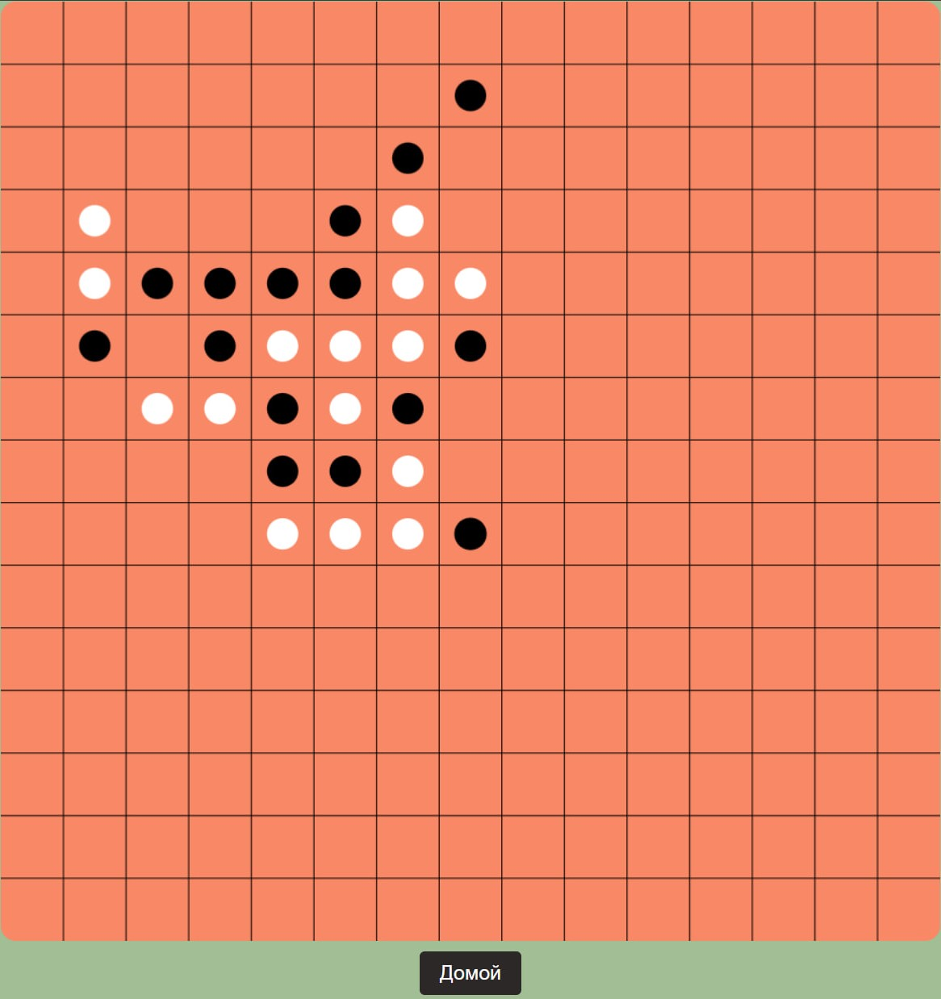
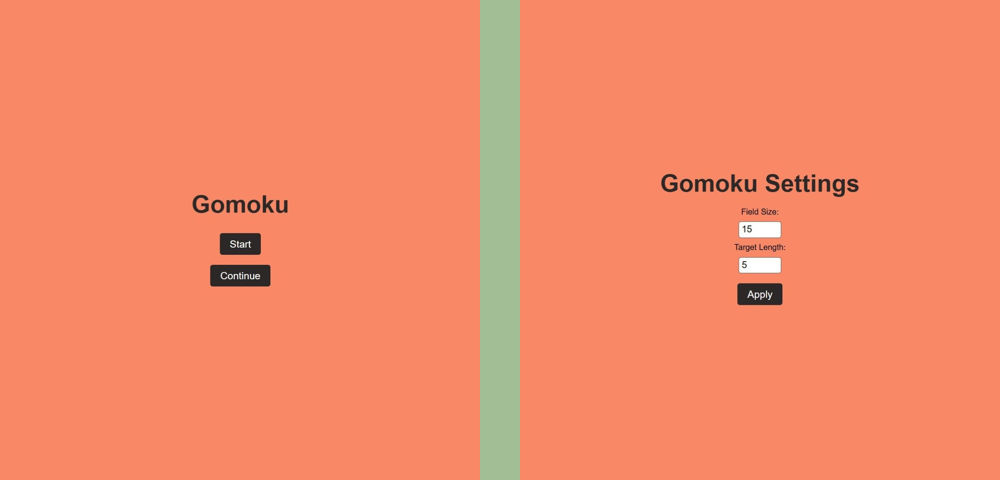

# gomocu-web

Игра написана с использованием python - flask, позиция обрабатывается на сервере и отправляется клиенту. У бота есть уязвимости, но тем не менее, играет он неплохо)

## Игровое поле

## Главное меню и выбор размера поля:

# TODO

- Нормально ограничить минимальные и максимальные значения
- Переписать эвристику
- Засунуть в docker контейнер

